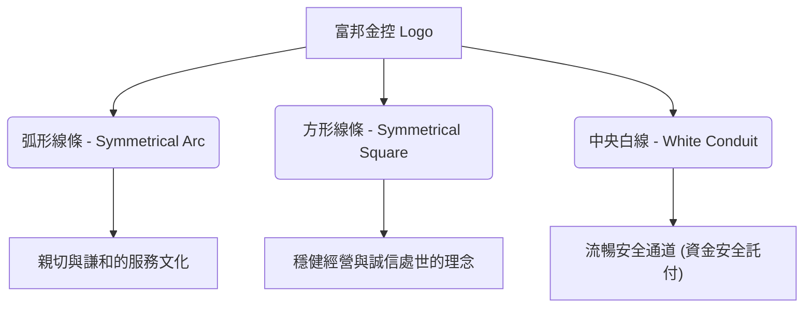
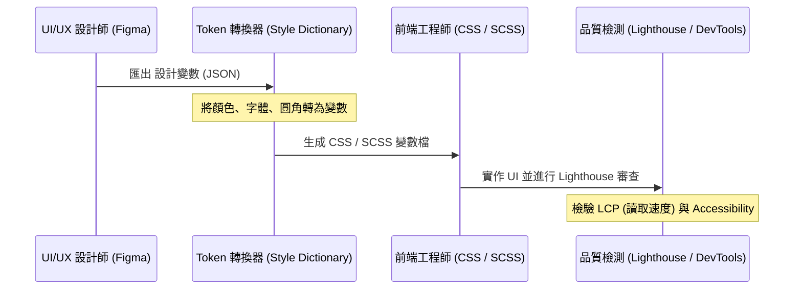

# 富邦金控 (Fubon Financial) 品牌與數位設計系統規範 (Brand & Digital Design System Guide)

本文件為**富邦金控 (Fubon Financial Holding)** 專屬的設計系統規範（Design System Specification），涵蓋企業識別系統 (Visual Identity System, VIS) 的核心要素，並延伸至現代數位介面 (Web / App) 的 UI/UX 設計標準。

此規範旨在確保富邦金控旗下所有子公司（包括富邦人壽、台北富邦銀行、富邦產險、富邦證券等）在數位管道上呈現一致、誠信、專業、創新且兼具包容性的高質感品牌形象。

---

## 1. 品牌核心與識別理念 (Brand Identity)

富邦金控以「**誠信、親切、專業、創新**」為核心價值，並以「**正向力量，開創未來**」為品牌理念。其企業識別系統 (VIS) 充分展現了有為有守的經營哲學與和諧創新的風格。

### 標誌 (Logo) 構成與設計美學



*   **弧形線條 (Symmetrical Arc)**：代表服務的「親切」與「謙和」，強調以客為尊、溫暖貼心的服務精神。
*   **方形線條 (Symmetrical Square)**：代表經營的「穩健」與「誠信」，展現深厚的專業實力與安全保障。
*   **中間白色線條 (White Conduit)**：代表資金與價值的安全流通管道，象徵客戶託付資產於富邦，能獲得最穩妥、最可靠的保障。
*   **色彩意涵**：以藍色與綠色互相輝映，展現清新與國際化的宏觀視野，帶領客戶邁向綠色永續與財富增值。

---

## 2. 品牌色彩系統 (Brand Color Palette)

富邦金控的標準色（企業色）以**富邦藍 (Fubon Blue)** 與**富邦綠 (Fubon Green)** 為雙核心，輔以嚴格規劃的次要色、中性色與語意色，以確保數位介面上的視覺平衡與高對比閱讀性（符合 WCAG AA 級標準）。

### 核心標準色 (Brand Core Colors)

| 顏色名稱 | 視覺預覽 | HEX 碼 | RGB 數值 | 品牌意涵與數位定位 |
| :--- | :--- | :--- | :--- | :--- |
| **富邦藍 (Fubon Blue)** | <span style="display:inline-block;width:30px;height:15px;background-color:#0095B8;border:1px solid #ddd;vertical-align:middle;"></span> | `#0095B8` | `0, 149, 184` | **核心企業色。** 代表國際觀、專業、創新、開闊的天空。常用於主要按鈕、重點強調、高亮標籤。 |
| **富邦綠 (Fubon Green)** | <span style="display:inline-block;width:30px;height:15px;background-color:#00A29D;border:1px solid #ddd;vertical-align:middle;"></span> | `#00A29D` | `0, 162, 157` | **核心企業色。** 代表永續金融、親切誠信、希望的大地。常用於成功狀態、綠色金融專區、次要強調。 |

### 數位延伸與輔助色 (Digital Accents & Sub-brands)

富邦旗下子公司與特定業務線擁有特定的標誌性輔助色：

| 子公司/業務 | 輔助色名稱 | 視覺預覽 | HEX 碼 | 應用場景 |
| :--- | :--- | :--- | :--- | :--- |
| **台北富邦銀行** | 皇家深藍 (Royal Navy) | <span style="display:inline-block;width:30px;height:15px;background-color:#003366;border:1px solid #ddd;vertical-align:middle;"></span> | `#003366` | 尊榮、財富管理、沈穩信任感 (Deep Trust) |
| **富邦證券** | 活力暖橙 (Vibrant Orange) | <span style="display:inline-block;width:30px;height:15px;background-color:#FF8200;border:1px solid #ddd;vertical-align:middle;"></span> | `#FF8200` | 證券交易、高動態投資看板、市場亮點 (Market Spark) |
| **富邦人壽** | 永續翠綠 (Eco Jade) | <span style="display:inline-block;width:30px;height:15px;background-color:#007B5F;border:1px solid #ddd;vertical-align:middle;"></span> | `#007B5F` | 人身保障、ESG 永續倡議、溫馨關懷 |
| **富邦產險** | 安全防護綠 (Shield Mint) | <span style="display:inline-block;width:30px;height:15px;background-color:#00BFA5;border:1px solid #ddd;vertical-align:middle;"></span> | `#00BFA5` | 意外保障、智能核保、安心感與防災防護 |

### 中性色與介面背景 (Neutral Colors & Interfaces)

數位產品需具備優雅的空氣感與極簡層次，我們定義了以下中性色系（含極簡亮色與尊榮暗色）：

```css
:root {
  /* 亮色模式 (Light Mode) */
  --neutral-100: #FFFFFF; /* 純白背景 */
  --neutral-200: #F4F7F6; /* 霧面淺綠灰 (減輕視覺疲勞) */
  --neutral-300: #E2E8F0; /* 邊框與分隔線 */
  --neutral-400: #94A3B8; /* 輔助圖示與 placeholder */
  --neutral-700: #475569; /* 次要文字與描述 */
  --neutral-900: #1E293B; /* 主要內文與標題 */

  /* 尊榮深色模式 (Premium Dark Mode) */
  --dark-bg-pure: #090F1C;   /* 宇宙極致藍黑 (基底背景) */
  --dark-bg-card: #121B2E;   /* 卡片背景 (Glassmorphism 基礎) */
  --dark-border:  #1E2E4A;   /* 精緻幽藍邊框 */
  --dark-text-main: #F8FAFC; /* 純白亮字 */
  --dark-text-sub:  #94A3B8; /* 灰藍輔助字 */
}
```

> [!NOTE]
> **無障礙對比提醒 (WCAG Accessibility)**
> 在任何數位頁面上，若使用 `#FFFFFF` 文字，其背景色的對比度必須達到 **4.5:1** 以上。在亮色背景上，主要文字必須使用 `--neutral-900` (`#1E293B`) 或更深色彩，以符合台灣金管會「金融友善與無障礙網頁規範」。

---

## 3. 字體與排版系統 (Typography & Hierarchy)

字體是傳遞金融專業與科技創新感的關鍵媒介。富邦設計系統規定使用現代非襯線體 (Sans-serif)，以確保在各式螢幕尺寸下的清晰可讀性。

### 推薦字型家族 (Font Family)

*   **繁體中文 (Traditional Chinese)**：思源黑體 (`Noto Sans TC`)、微軟正黑體 (`Microsoft JhengHei`)、PingFang TC (iOS/macOS)。
*   **英文與數字 (Latin & Numbers)**：`Inter`、`Montserrat` (用於大標題以展現氣勢)、`Segoe UI` (Windows)、`Helvetica Neue` (macOS)。

### 字體層級系統 (Typography Scale)

| 層級名稱 | CSS 類別 / 標籤 | 大小 (REM / PX) | 字重 (Weight) | 行高 (Line Height) | 適用場景 |
| :--- | :--- | :--- | :--- | :--- | :--- |
| **超大標題** | `.display-1` / `h1` | `2.5rem` / `40px` | 700 (Bold) | 1.2 | 行銷活動主視覺標題、大額數據顯示 |
| **首頁大標** | `.h1` / `h1` | `2.0rem` / `32px` | 700 (Bold) | 1.3 | 區塊主標題、Dashboard 總資產標題 |
| **區塊中標** | `.h2` / `h2` | `1.5rem` / `24px` | 600 (Semi-Bold) | 1.4 | 卡片標題、分頁標題、表單群組標題 |
| **小標/按鈕** | `.h3` / `h3` | `1.25rem` / `20px` | 600 (Semi-Bold) | 1.4 | 按鈕文字、明細欄位標題 |
| **主內文** | `.body-regular` / `p`| `1.0rem` / `16px` | 400 (Regular) | 1.6 | 預設文字、說明文件、交易明細內容 |
| **輔助說明** | `.body-small` | `0.875rem` / `14px` | 400 (Regular) | 1.5 | 注意事項、輸入框提示詞、時間戳記 |
| **極小提示** | `.caption` | `0.75rem` / `12px` | 500 (Medium) | 1.4 | 微型圖表標籤、表單錯誤驗證訊息 |

---

## 4. UI 核心組件與互動規範 (UI Components & Motion)

為了貫徹「正向力量」與「創新」的精神，富邦的 UI 組件採用了**流線微弧角 (Smooth Rounded Corners)**、**輕量化微陰影 (Subtle Elevation)** 與**優雅的微互動 (Micro-animations)**。

### 4.1 按鈕規範 (Buttons)

按鈕是金融交易中最核心的轉換元件，必須清晰且易於點擊。

```css
/* 富邦標準主要按鈕樣式 */
.fb-btn-primary {
  background: linear-gradient(135deg, #0095B8 0%, #00A29D 100%);
  color: #FFFFFF;
  border: none;
  border-radius: 8px; /* 流線微弧角 */
  padding: 12px 24px;
  font-family: 'Inter', 'Noto Sans TC', sans-serif;
  font-weight: 600;
  font-size: 16px;
  letter-spacing: 0.5px;
  box-shadow: 0 4px 14px rgba(0, 149, 184, 0.25);
  transition: all 0.3s cubic-bezier(0.25, 0.8, 0.25, 1);
  cursor: pointer;
  display: inline-flex;
  align-items: center;
  justify-content: center;
  gap: 8px;
}

/* 懸停動效：按鈕略微放大，光暈陰影加深 */
.fb-btn-primary:hover {
  transform: translateY(-2px);
  box-shadow: 0 6px 20px rgba(0, 149, 184, 0.4);
  background: linear-gradient(135deg, #00a5cc 0%, #00b3ad 100%);
}

/* 點擊反饋：按鈕壓下 */
.fb-btn-primary:active {
  transform: translateY(1px);
  box-shadow: 0 2px 8px rgba(0, 149, 184, 0.2);
}

/* 禁用狀態：沈穩中性灰色 */
.fb-btn-primary:disabled {
  background: #CBD5E1;
  color: #94A3B8;
  box-shadow: none;
  cursor: not-allowed;
  transform: none;
}
```

### 4.2 卡片設計 (Glassmorphism Cards)

金融儀表板（Dashboard）常使用卡片承載帳戶餘額、理財產品等重要資訊。推薦使用**微漸變玻璃擬態 (Glassmorphism)** 以展現尊榮現代感：

```css
/* 尊榮理財卡片 (Premium Wealth Card) */
.fb-card-wealth {
  background: rgba(18, 27, 46, 0.7);
  backdrop-filter: blur(20px);
  -webkit-backdrop-filter: blur(20px);
  border: 1px solid rgba(0, 149, 184, 0.15);
  border-radius: 16px;
  padding: 24px;
  box-shadow: 0 8px 32px 0 rgba(0, 0, 0, 0.3);
  position: relative;
  overflow: hidden;
  transition: border-color 0.3s ease, transform 0.3s ease;
}

/* 裝飾線條 - 呼應 Logo 弧線 */
.fb-card-wealth::before {
  content: "";
  position: absolute;
  top: -50%;
  right: -30%;
  width: 200px;
  height: 200px;
  border-radius: 50%;
  background: radial-gradient(circle, rgba(0,149,184,0.15) 0%, rgba(0,0,0,0) 70%);
  pointer-events: none;
}

/* 懸浮效果：邊框漸變色亮起 */
.fb-card-wealth:hover {
  border-color: rgba(0, 162, 157, 0.4);
  transform: translateY(-4px);
}
```

### 4.3 頁面與組件微動效 (Motion Standards)

動效不應花俏，而是要流暢自然、具備「物理反饋感」，用以引導用戶完成關鍵任務。

*   **微交互持續時間 (Micro-interaction Duration)**：`150ms` ~ `250ms`。
*   **區塊切換/頁面展開持續時間**：`300ms` ~ `450ms`。
*   **推薦貝氏曲線 (Easing Curve)**：
    *   進入畫面 (Ease-out)：`cubic-bezier(0.215, 0.610, 0.355, 1.000)` (Deceleration)
    *   退出畫面 (Ease-in)：`cubic-bezier(0.550, 0.055, 0.675, 0.190)` (Acceleration)
    *   按鈕 hover / 彈跳 (Custom Spring)：`cubic-bezier(0.175, 0.885, 0.32, 1.275)`

---

## 5. 金融無障礙與高齡友善規範 (Accessibility & Elderly-friendly)

富邦金控極度重視「普惠金融」與「金融友善服務」。考量到高齡用戶與視障用戶的需求，數位產品設計必須嚴格執行以下無障礙（Accessibility, a11y）標準：

> [!IMPORTANT]
> **金融友善三金律 (Three Golden Rules for Friendly Finance)**
> 1.  **大字體一鍵切換**：所有數位理財 App 與官方網站，皆必須在顯眼處提供「大字體模式 (Senior Mode)」切換按鈕。
> 2.  **高對比無障礙色**：禁止使用淺灰色文字放置在白底上。核心金額、提示字眼、錯誤警告必須使用強對比色（對比度 $\ge 4.5:1$）。
> 3.  **語音報讀相容性**：所有按鈕、輸入框、圖片都必須寫入明確的 `aria-label` 或 `alt` 屬性，確保螢幕閱讀器 (VoiceOver / TalkBack) 能精確播報。

### 行動版點擊目標尺寸 (Tap Targets)

行動裝置上的按鈕、連結、輸入框等可點擊區域，最小尺寸必須達到 **$48 \times 48$ 像素 (dp/px)**，且相鄰點擊目標之間必須有至少 **8 像素** 的安全間距，以防高齡用戶誤觸。

---

## 6. 設計與開發協作工作流 (Design-to-Code Workflow)

為了使設計稿完美落地，富邦推薦使用「Token-based」的敏捷開發流程：



### 開發團隊快速入門 (Quick Start for Developers)

前端工程師在進行專案初始化時，請直接引入以下 `fubon-theme.css`：

```css
/* fubon-theme.css */
@import url('https://fonts.googleapis.com/css2?family=Inter:wght@400;500;600;700&family=Noto+Sans+TC:wght@400;500;700&display=swap');

:root {
  /* 品牌標準色 */
  --fb-blue: #0095B8;
  --fb-green: #00A29D;
  --fb-blue-rgb: 0, 149, 184;
  --fb-green-rgb: 0, 162, 157;

  /* 子公司特有色 */
  --fubank-navy: #003366;
  --fusec-orange: #FF8200;
  --fulife-green: #007B5F;

  /* 語意狀態色 */
  --fb-success: #10B981;
  --fb-warning: #F59E0B;
  --fb-danger: #EF4444;
  --fb-info: #3B82F6;

  /* 中性背景與邊框 */
  --fb-bg-light: #F4F7F6;
  --fb-bg-card: #FFFFFF;
  --fb-border: #E2E8F0;
  --fb-text-primary: #1E293B;
  --fb-text-secondary: #475569;

  /* 圓角定義 */
  --fb-radius-sm: 4px;
  --fb-radius-md: 8px;
  --fb-radius-lg: 16px;
  --fb-radius-full: 9999px;

  /* 陰影定義 */
  --fb-shadow-subtle: 0 4px 6px -1px rgba(0, 0, 0, 0.05), 0 2px 4px -1px rgba(0, 0, 0, 0.03);
  --fb-shadow-hover: 0 10px 15px -3px rgba(0, 0, 0, 0.1), 0 4px 6px -2px rgba(0, 0, 0, 0.05);
}

/* 基礎重設與金融無障礙 */
body {
  background-color: var(--fb-bg-light);
  color: var(--fb-text-primary);
  font-family: 'Inter', 'Noto Sans TC', sans-serif;
  line-height: 1.6;
  -webkit-font-smoothing: antialiased;
}

/* 確保鍵盤聚焦狀態清晰可見 */
*:focus-visible {
  outline: 3px solid rgba(var(--fb-blue-rgb), 0.6);
  outline-offset: 2px;
}
```

---

## 7. 總結與品牌合規審查 (Compliance)

所有發布於外部之數位產品，在上線前必須通過富邦金控內部品牌小組（Brand Steering Committee）與資安/無障礙合規小組的審查。

> [!CAUTION]
> **商標與品牌安全警示**
> 富邦金控商標、字體商標組合與標準徽章是受法律保護的註冊商標。嚴禁未經正式品牌授權進行外部產品或商業宣傳使用。在設計任何新產品時，請務必遵照本《設計系統規範》並向相關子公司之窗口提交審查。

---

*最新更新日期：2026年5月28日*
*版本：v2.1.0*
*富邦金控 品牌管理處 暨 數位金融委員會 聯合發行*
